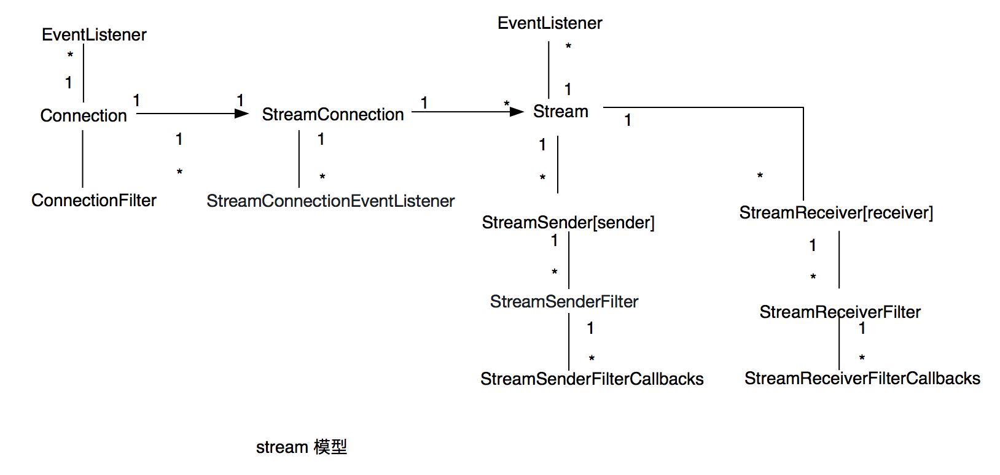

# MOSN 架构

In mosn, we have 4 layers to build a mesh, which are NET/IO, Protocol、Stream、and Proxy

+ Net/IO layer is the fundamental layer to support upper level's functionality;
  Core model in network layer are listener and connection. 
  Listener listens specified port, waiting for new connections.
  Both listener and connection have a extension mechanism, implemented as listener and filter chain, which are used to fill in customized logic.
  Event listeners are used to subscribe important event of Listener and Connection. Method in listener will be called on event occur, but not effect the control flow.
  Filters are called on event occurs, it also returns a status to effect control flow. Currently 2 states are used: Continue to let it go, StopIteration to stop the control flow.
  Filter has a callback handler to interactive with core model. For example, ReadFilterCallbacks can be used to continue filter chain in connection, on which is in a stopped state.
  
  + Listener:
    + Event listener
        + ListenerEventListener
    + Filter
  	    + ListenerFilter
  + Connection:
  	+ Event listener
  	    + ConnectionEventListener
  	+ Filter
  	    + ReadFilter
  	    + WriteFilter
  
  + Below is the basic relation on listener and connection:
    

+ Protocol layer used to decode/encode request/response for different protocol. Stream layer leverages protocol's 
  ability to do binary-model conversation. In detail, Stream uses Protocols's encode/decode facade method and DecodeFilter to receive decode event call.

+ Stream layer is the inheritance layer to bond protocol layer and proxy layer together. 
  Core model in stream layer is stream, which manages process of a round-trip, a request and a corresponding response.
  Event listeners can be installed into a stream to monitor event.
  + Stream has two related models, encoder and decoder:
	+ StreamSender: a sender encodes request/response to binary and sends it out, flag 'endStream' means data is ready to sendout, no need to wait for further input.
	+ StreamReceiver: It's more like a decode listener to get called on a receiver receives binary and decodes to a request/response.
	+ Stream does not have a predetermined direction, so StreamSender could be a request encoder as a client or a response encoder as a server. It's just about the scenario, so does StreamReceiver.
  + Stream:
    + Event listener
  		+ StreamEventListener
    + Encoder
  	    + StreamSender
  	+ Decoder
  	    + StreamReceiver
  + In order to meet the expansion requirements in the stream processing, StreamEncoderFilters and StreamDecoderFilters are introduced as a filter chain in encode/decode process.
  Filter's method will be called on corresponding stream process stage and returns a status(Continue/Stop) to effect the control flow.
  + From an abstract perspective, stream represents a virtual process on underlying connection. To make stream interactive with connection, some intermediate object can be used.
  StreamConnection is the core model to connect connection system to stream system. As a example, when proxy reads binary data from connection, it dispatches data to StreamConnection to do protocol decode.
  Specifically, ClientStreamConnection uses a NewStream to exchange StreamReceiver with StreamSender.
  Engine provides a callbacks(StreamSenderFilterCallbacks/StreamReceiverFilterCallbacks) to let filter interact with stream engine.
  As a example, a encoder filter stopped the encode process, it can continue it by StreamSenderFilterCallbacks.ContinueEncoding later. Actually, a filter engine is a encoder/decoder itself.

  + Below is the basic relation on stream and connection:
    

+ Proxy Layer used to retransmit the data between downstream and upstream which contains following parts:
  + Router
  + LoadBalancer
  + HealthCheck 