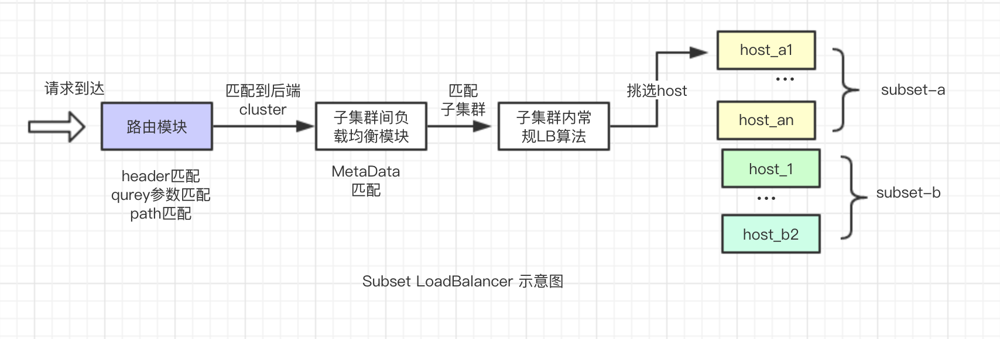

# SubSet LoadBalancer开发文档

## Subset lb整体流程
subset load balancer用于在cluster内部根据metadata做子集群匹配，发生在路由匹配到cluster成功之后，再挑选具体的子集群
下面是带有suset lb功能的mosn的工作流程：


# 功能实现模块划分
  ##  part1.  RDS 路由模块
  + router需要根据配置中的 metadata生成 metadata match criteria，match criteria（匹配参数) 为许多组 key和value组成，且按照key进行字典排序，value为md5后的hash值，实现函数: NewMetadataMatchCriteriaImpl
  + choose host的时候，需要将router的metadata match criteria作为上下文传递下去，
       上下文的定义: LoadBalancerContext
  + 其中，activestrem实现了LoadBalancerContext ，在建立连接池的时候，作为ctx传递下去
  
  ##  part2.  CDS/EDS 后端生成模块
  
  + cluster根据配置，生成cluster lb subset 相关信息，包括，生成字典序的subset selectors以及default subset等，实现函数：NewLBSubsetInfo
  + lbsubsetinfo根据配置中subsetselectors是否为空，决定subset lb是否开启，在开启时，创建subset loadbalancer
  + 后端cluster基于host的 metadata 生成字典树形式存储的subset 
  
  ##  part3.  类与接口
  
  + 实现类 subSetLoadBalancer，关键成员：fallbackSubset作为兜底选择的子集群，subSets为保存的字典树结构存储的子集群
  其中，fallbacksubset的生成函数 : UpdateFallbackSubset
  + subset的生成函数： ProcessSubsets/FindOrCreateSubset
  + subset的查询函数：FindSubset
  + 存储subset中 hosts的类: PrioritySubsetImpl
  
  ++ 关键数据结构
  + 字典树的root节点
  ```go
  // key: 第一个匹配key
  // value：用于指向
  type LbSubsetMap map[string]ValueSubsetMap
```

  + 中间节点
  ```go
  //  hashvalue为索引值 
  type ValueSubsetMap map[HashedValue]LBSubsetEntry
```

  + 索引节点
  ```go
  // children指向下一个 ValueSubsetMap，为空的话表示是叶子节点
  // prioritySubset 为满足当前metadata 的子集群，在LBSubsetEntry为叶子节点时指向具体的子集群
  type LBSubsetEntry struct {
  	children       types.LbSubsetMap
  	prioritySubset types.PrioritySubset
  }
```

  + 其他：
    pair类型来存储key 
    value值
  ```go
  type SubsetMetadata []Pair
  
  type Pair struct {
  	T1 string
  	T2 HashedValue
  }
  ```
  
  + 成员为string的有序的set
  ```go
  // realize a sorted string set
  type SortedStringSetType struct {
     keys []string
  }
```

